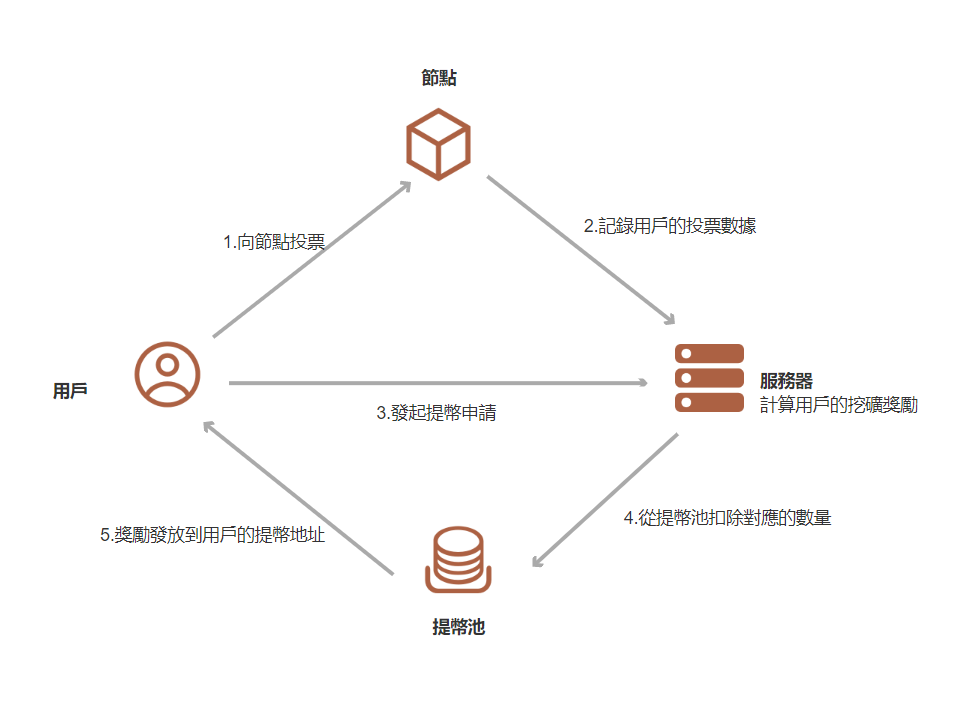

# Staking收益计算

<figure><figcaption></figcaption></figure>

* 用戶將持有的資產對節點投票完成質押；&#x20;
* 中心化服務器處理用戶的投票紀錄，包括投票時間，所占比列等數據，并计算出用户的收益：每日獎勵KIKI數量=質押幣數量x質押幣價格x日化率 / KIKI價格; 日化率(Daily)=年化率(APR) / 365；每日產生的獎勵，當日釋放20%，剩下部分線性釋放，每日釋放1% ；
* 用戶向服務器發起提幣請求，並提交提筆的地址；
* 服務器根據用戶的請求，從提幣池扣除對應的提幣數量；
* 從提幣池將獎勵發送到用戶的提幣地址。
